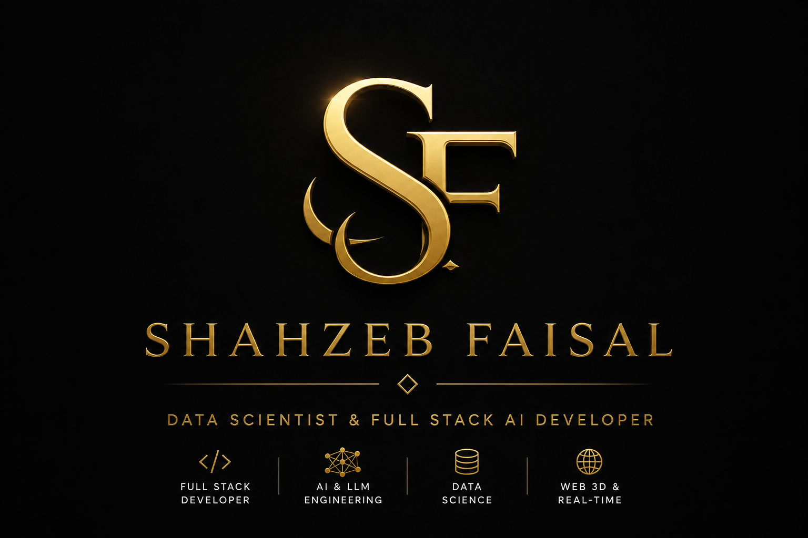

<div align="center">



# Shahzeb Faisal | Premium Developer Portfolio

**MERN Stack Developer @ NEXTSTAC**

[](https://my-portfolio-hazel-seven-40.vercel.app)
[](https://github.com/ShahzebFaisal5649)
[](https://www.linkedin.com/in/shahzeb-faisal-8b9190321/)
[](mailto:shahzebfaisal5649@gmail.com)

*A masterclass in modern web aesthetics, performance, and interactive AI experiences.*

---
</div>

## 🌟 Overview

Welcome to the source code of my premium, highly interactive personal portfolio. Built to push the boundaries of frontend engineering, this repository showcases my expertise in **MERN Stack Development**, **Next.js**, and **AI integrations**.

The platform is designed with a state-of-the-art dark/gold luxury theme, featuring fluid glassmorphism, responsive grids, and subtle micro-animations that elevate the user experience.

### 🚀 Key Highlights

- **Live Projects Cataloged:** 16+ Production-grade applications.
- **Performance:** Optimized asset loading with zero layout shift (CLS).
- **Aesthetic:** Tailored Gold (`#c9a84c`) & Obsidian Dark Mode.
- **Interactivity:** GSAP-inspired cubic-bezier transitions & Three.js particle networks.

---

## ✨ Signature Features

### 💻 AI Developer Terminal (`Ctrl + .`)
Experience my portfolio like a hacker. The globally accessible command-line terminal allows you to:
- Navigate pages instantly (e.g., `cd projects`).
- Execute commands to download my resume, clear logs, or contact me.
- Enjoy an authentic, macOS-inspired glowing console environment.

### 🤖 Gemini AI Chat Companion
An embedded, context-aware AI assistant powered by the **Gemini-2.5-flash** API.
- Fully trained on my resume, tech stack, and GitHub repositories.
- Fluid conversational UI with real-time markdown parsing.
- Rate-limit resilient with robust error handling.

### 🎨 Ultra-Premium UI/UX
- **Neural Background:** A dynamic, interactive network animation that tracks cursor movement.
- **Holographic Cards:** 3D perspective hover effects on project, certification, and skill modules.
- **Glassmorphism:** Elegant frosted glass layers across navigation bars and modal overlays.
- **Responsive Layout:** Pixel-perfect rendering from 4K desktop displays down to mobile screens.

---

## 🛠️ Technology Stack

<div align="center">

### Core Architecture


### MERN & Framework Ecosystem


### Tools & Deployment


</div>

---

## 💼 Professional Experience

### MERN Stack Developer | NEXTSTAC
*January 2025 – Present*
- Single-handedly engineered **DesignCustomBox** — a high-performance 3D packaging e-commerce platform.
- Integrated WebGL visualizers, Stripe payment gateways, and scalable admin CMS dashboards.
- Delivered production-ready systems from concept to launch within a rapid 7-day lifecycle.

### AI-First Web Development Intern | Nexium
*July – August 2025*
- Architected the **Resume Tailor**, an AI tool utilizing GPT-4 to optimize CVs against ATS parsers, achieving a 30% metric boost.
- Deployed robust applications using Next.js 15, TypeScript, and Supabase.

### Data & Software Intern | Kashf Foundation
*July – August 2024*
- Streamlined database architecture and optimized complex SQL queries, decreasing data retrieval latency by 40%.
- Designed intuitive, real-time compliance dashboards for enterprise monitoring.

---

## 🚀 Quick Start Guide

Want to run this portfolio locally? Follow these steps:

1. **Clone the repository:**
   ```bash
   git clone https://github.com/ShahzebFaisal5649/My-Portfolio.git
   cd My-Portfolio
   ```

2. **Configure Environment Variables:**
   Open `Scripts/config.js` (or `Scripts/env.local.js`) and input your API keys:
   ```javascript
   window.GEMINI_API_KEY = "YOUR_GEMINI_API_KEY_HERE";
   // Note: EmailJS keys should be configured in Scripts/contact.js
   ```

3. **Launch Local Server:**
   You can use any local HTTP server. For example:
   ```bash
   # Using Python
   python -m http.server 8000
   
   # Using Node.js
   npx serve -p 8000
   ```

4. **Explore:**
   Navigate to `http://localhost:8000` in your browser.

---

## 🌐 Deployment

This project is optimized for edge deployment via **Vercel**. The current live build automatically syncs with the `main` branch.

```bash
# Deploying manually via Vercel CLI
npm i -g vercel
vercel login
vercel --prod
```

---

## 📫 Let's Connect

I am actively open to discussing opportunities in **MERN Stack Development**, **Next.js Engineering**, and **Full-Stack Architecture**.

<div align="center">

| Channel | Link |
|---------|------|
| **Email** | [shahzebfaisal5649@gmail.com](mailto:shahzebfaisal5649@gmail.com) |
| **WhatsApp** | [+92 302 0418510](https://wa.me/923020418510) |
| **LinkedIn** | [shahzeb-faisal-8b9190321](https://www.linkedin.com/in/shahzeb-faisal-8b9190321/) |
| **Location** | Lahore, Punjab, Pakistan 🇵🇰 |

<br>
<i>Crafted with precision, passion, and code by Shahzeb Faisal.</i>

</div>
